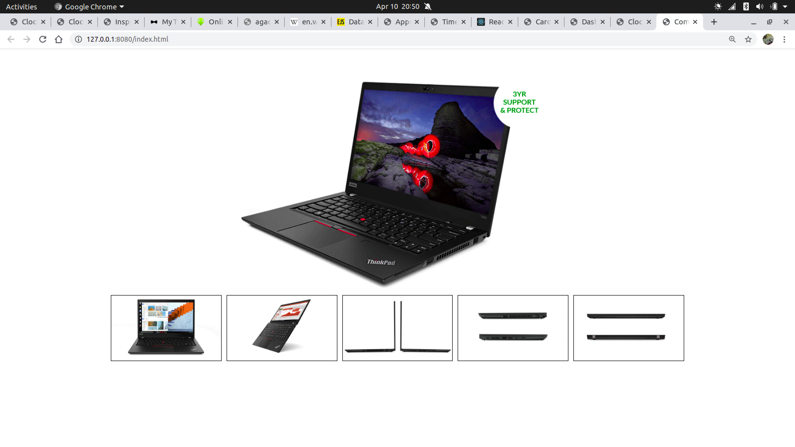

# Flex Box 

Use your last week knowledge on flex-box. Please don't be intimidated by the design take a closer, and you will find your way out.  The materials(pictures) for this design are in the images folder please do utilize them in other to complete your assignment: 

## Pro Tips:

* Make a sketch of this design on paper before coding.
* Do your house-keeping task.
* Open `intro-to-flexbox` in VS Code and do your coding.
* Create a `h1` tag with a **"Hello World"** and apply a `background` of **black** with a `color` of **white** on the `body`
* Open your project with `live-server` and see whether your contents and your styles are loaded correctly. 
* When done add your changes and push your codes back to github.
* Share you URL to my email.

Use the design below as a guide and try to replicate it in to code:

Happy Coding!